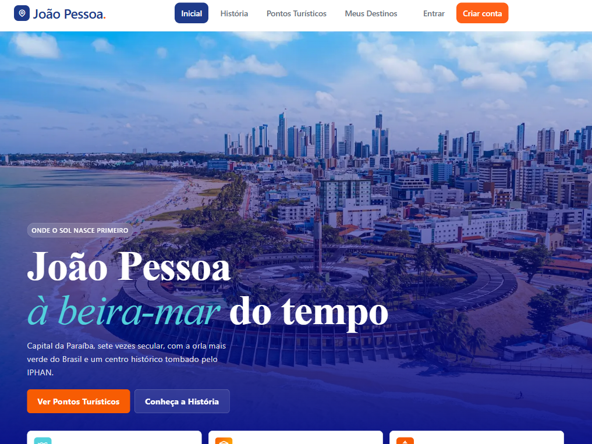
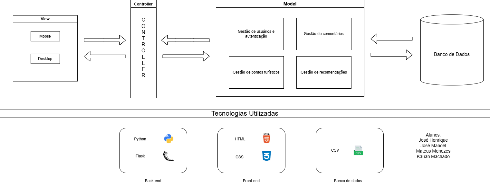
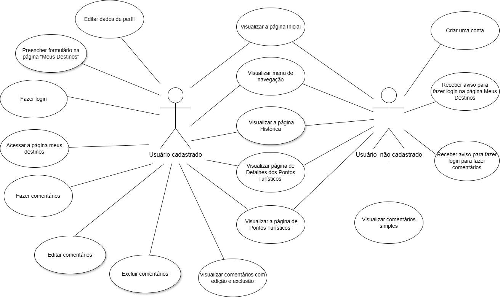

<div align="center">

# 🌴 Vem pra Jampa

### Descubra João Pessoa de forma inteligente, personalizada e inesquecível.

Projeto interdisciplinar desenvolvido no **Instituto Federal da Paraíba (IFPB) – Campus João Pessoa**, integrando as disciplinas de **Introdução à Programação**, **Introdução à Engenharia de Software** e **Programação para Web I**.


</div>

---

# 📖 Descrição do Projeto

O **Vem pra Jampa** é uma plataforma web desenvolvida com o propósito de incentivar o turismo inteligente na cidade de **João Pessoa – Paraíba**, reunindo informações relevantes sobre os principais atrativos turísticos em uma interface moderna, intuitiva e responsiva.

O projeto surgiu a partir da percepção de uma dificuldade comum enfrentada por turistas independentes: a necessidade de consultar diferentes blogs, redes sociais e páginas da internet para planejar uma viagem. Esse excesso de informações frequentemente gera perda de tempo, dúvidas e dificuldades para organizar um roteiro adequado aos interesses de cada visitante.

Com o objetivo de solucionar esse problema, foi desenvolvido um sistema capaz de centralizar informações sobre a capital paraibana em um único ambiente digital. A plataforma permite que o usuário conheça a história da cidade, explore pontos turísticos, registre seus destinos favoritos, compartilhe experiências por meio de comentários e gerencie sua própria conta, proporcionando uma experiência mais organizada, personalizada e acessível.

Além de seu propósito turístico, o projeto possui forte caráter acadêmico, demonstrando a aplicação prática dos conhecimentos adquiridos ao longo das disciplinas envolvidas. Toda a aplicação foi desenvolvida utilizando apenas tecnologias fundamentais do desenvolvimento web, sem o uso de bancos de dados relacionais ou frameworks JavaScript, evidenciando que é possível construir uma aplicação completa utilizando **Python**, **Flask**, **HTML5**, **CSS3**, **Jinja2** e arquivos **CSV** como mecanismo de persistência de dados.

Durante seu desenvolvimento foram aplicados diversos conceitos de Engenharia de Software, incluindo levantamento de requisitos, modelagem UML, arquitetura MVC, prototipação de interfaces, versionamento com Git e desenvolvimento colaborativo através do GitHub.

---

# 🖼️ Demonstração

A seguir é apresentada a interface principal da plataforma **Vem pra Jampa**, desenvolvida com foco em proporcionar uma experiência visual agradável, intuitiva e responsiva para diferentes dispositivos.

<div align="center">



**Figura 1 — Página inicial do sistema.**

</div>

A interface foi projetada buscando transmitir a identidade turística da cidade de João Pessoa por meio de uma linguagem visual moderna, combinando elementos gráficos, tipografia elegante e uma navegação simplificada para facilitar o acesso às principais funcionalidades da plataforma.

---

# ✨ Funcionalidades

O sistema reúne um conjunto de funcionalidades voltadas tanto para visitantes quanto para usuários cadastrados, oferecendo recursos que tornam o planejamento da viagem mais simples e personalizado.

## 🌍 Exploração Turística

* Visualização da página inicial;
* Apresentação da história de João Pessoa;
* Catálogo de pontos turísticos da cidade;
* Informações descritivas sobre cada atração.

---

## 👤 Sistema de Usuários

* Cadastro de novos usuários;
* Autenticação por login;
* Encerramento seguro da sessão (Logout);
* Edição do perfil do usuário;
* Alteração de nome, e-mail e senha;
* Exclusão permanente da conta.

---

## 💬 Sistema de Comentários

* Publicação de comentários sobre os pontos turísticos;
* Visualização das opiniões de outros visitantes;
* Associação automática entre comentários e seus respectivos autores;
* Remoção automática dos comentários quando a conta é excluída.

---

## 🎯 Personalização da Experiência

* Recomendação personalizada de destinos turísticos;
* Organização da navegação de forma intuitiva;
* Interface responsiva para computadores, tablets e smartphones;
* Mensagens de feedback para ações realizadas pelo usuário.

---

# 🚀 Tecnologias Utilizadas

O desenvolvimento do projeto priorizou a utilização de tecnologias amplamente consolidadas no desenvolvimento web, permitindo a construção de uma aplicação robusta, organizada e de fácil manutenção.

| Tecnologia                                                                   | Finalidade                                                                            |
| ---------------------------------------------------------------------------- | ------------------------------------------------------------------------------------- |
|  **Python 3.13.14** | Linguagem utilizada no desenvolvimento do backend e da lógica da aplicação.           |
|  **Flask 3.1.3**     | Framework responsável pelo gerenciamento das rotas, sessões e estrutura da aplicação. |
|  **HTML5**           | Estruturação das páginas do sistema.                                                  |
|  **CSS3**              | Estilização da interface e implementação da responsividade.                           |
| **Jinja2**                                                                   | Renderização dinâmica dos templates HTML.                                             |
| **CSV**                                                                      | Persistência simplificada dos dados da aplicação.                                     |
|  **Git**               | Controle de versão do projeto.                                                        |
|  **GitHub**         | Hospedagem do código-fonte e colaboração entre os integrantes da equipe.              |
|  **Figma**           | Prototipação das interfaces e planejamento do design do sistema.                     |

---

# 📁 Estrutura do Projeto

A organização do **Vem pra Jampa** foi planejada para facilitar a manutenção, escalabilidade e compreensão do código-fonte, adotando uma estrutura baseada na arquitetura **MVC (Model-View-Controller)**. Essa separação permite dividir as responsabilidades entre interface, regras de negócio e manipulação dos dados, tornando o desenvolvimento colaborativo mais organizado.

A estrutura principal do projeto é apresentada a seguir.

```text
Vem-pra-Jampa/
│
├── 📁 app/
│   ├── routes.py
│   ├── autenticacao.py
│   ├── recomendacao.py
│   ├── __init__.py
│   └── utils.py
│
├── 📁 data/
│   ├── usuarios.csv
│   ├── comentarios.csv
│   └── pontos.csv
│
├── 📁 docs/
│   ├── 📁 images/
│   │   ├── home.png
│   │   ├── casos-de-uso.png
│   │   └── arquitetura.png
│   └── requisitos.pdf
│
├── 📁 static/
│   ├── 📁 css/
│   └── 📁 images/
│
├── 📁 templates/
│   ├── base.html
│   ├── index.html
│   ├── pontos.html
│   └── ...
│
├── requirements.txt
├── run.py
├── README.md
└── .gitignore
```

## Organização dos diretórios

| Diretório            | Descrição                                                                                                                             |
| -------------------- | ------------------------------------------------------------------------------------------------------------------------------------- |
| **app/**             | Contém o núcleo da aplicação Flask, incluindo rotas, templates, arquivos estáticos e funções auxiliares.                              |
| **routes.py**          | Implementa as rotas responsáveis pelo fluxo de navegação e pelas funcionalidades do sistema.                                          |
| **templates/**       | Armazena todas as páginas HTML renderizadas pelo mecanismo de templates Jinja2.                                                       |
| **static/**          | Contém os arquivos estáticos utilizados pela interface, como folhas de estilo CSS e imagens.                                          |
| **data/**            | Responsável pela persistência dos dados utilizando arquivos CSV, armazenando usuários, comentários e demais informações da aplicação. |
| **docs/**            | Diretório destinado aos diagramas e imagens utilizadas na documentação do projeto.                                                    |
| **run.py**           | Arquivo responsável por iniciar a aplicação Flask.                                                                                    |
| **requirements.txt** | Lista todas as dependências necessárias para executar o projeto.                                                                      |

A organização apresentada busca favorecer a legibilidade do código, facilitar futuras manutenções e permitir que novos recursos sejam adicionados sem comprometer a estrutura existente.

---

# 🏗️ Arquitetura do Sistema

O sistema foi desenvolvido seguindo o padrão arquitetural **Model-View-Controller (MVC)**, amplamente utilizado em aplicações web por promover uma clara separação de responsabilidades.

Cada camada possui um papel específico dentro da aplicação:

* **Model (Modelo):** responsável pelo gerenciamento dos dados persistidos em arquivos CSV e pelas funções auxiliares de manipulação dessas informações.

* **View (Visão):** composta pelos templates HTML desenvolvidos com Jinja2, responsáveis pela interface apresentada ao usuário.

* **Controller (Controlador):** implementado através das rotas Flask, interpreta as requisições do usuário, executa as regras de negócio e determina qual página deverá ser renderizada.

Essa organização proporciona maior modularidade, facilita o trabalho em equipe e reduz o acoplamento entre os diferentes componentes da aplicação.

<div align="center">



**Figura 2 — Arquitetura geral do sistema.**

</div>

Durante o desenvolvimento, a arquitetura MVC permitiu que diferentes integrantes da equipe atuassem simultaneamente em partes distintas do sistema, reduzindo conflitos de integração e tornando o versionamento do código mais eficiente.

---

# 📑 Modelagem do Sistema

Antes da implementação, foram elaborados artefatos de Engenharia de Software que auxiliaram no levantamento dos requisitos e na organização da estrutura do projeto.

Esses diagramas serviram como base para o desenvolvimento das funcionalidades e para o planejamento da arquitetura adotada.

## Diagrama de Casos de Uso

O Diagrama de Casos de Uso representa as principais funcionalidades disponibilizadas aos usuários da plataforma, evidenciando as interações entre o ator principal e o sistema.

Entre as funcionalidades modeladas destacam-se:

* Cadastro de usuários;
* Autenticação;
* Gerenciamento do perfil;
* Consulta aos pontos turísticos;
* Publicação de comentários;
* Exclusão da conta;
* Recomendação de destinos.

<div align="center">



**Figura 3 — Diagrama de Casos de Uso do sistema.**

</div>

A modelagem contribuiu para identificar os requisitos funcionais da aplicação, orientar a implementação das funcionalidades e garantir maior organização durante o processo de desenvolvimento.

---

## Considerações sobre a Arquitetura

Embora o projeto utilize arquivos CSV como mecanismo de persistência dos dados, sua estrutura foi organizada de forma que uma futura migração para um Sistema Gerenciador de Banco de Dados (SGBD), como PostgreSQL ou MySQL, possa ser realizada com alterações mínimas na lógica da aplicação.

Essa decisão demonstra uma preocupação com a escalabilidade e a evolução do sistema, mesmo tratando-se de um Produto Mínimo Viável (MVP).

Além disso, a adoção do framework Flask, aliada ao padrão MVC e ao uso do mecanismo de templates Jinja2, proporcionou uma arquitetura simples, modular e adequada aos objetivos acadêmicos do projeto.

---

# ⚙️ Instalação e Execução

A seguir são apresentados os passos necessários para executar o projeto em um ambiente de desenvolvimento local.

## Pré-requisitos

Antes de iniciar, certifique-se de possuir os seguintes softwares instalados em sua máquina:

* Python **3.13.14** ou superior;
* Git;
* Gerenciador de pacotes **pip**.

---

## Clonando o repositório

```bash
git clone https://github.com/jmanoeldev/Vem-pra-Jampa.git
```

Acesse o diretório do projeto:

```bash
cd Vem-pra-Jampa
```

---

## Criando um ambiente virtual

### Windows

```bash
python -m venv venv
```

Ative o ambiente:

```bash
.venv\Scripts\activate
```

---

### Linux

```bash
python3 -m venv venv
source .venv/bin/activate
```

---

### macOS

```bash
python3 -m venv venv
source .venv/bin/activate
```

---

## Instalando as dependências

Com o ambiente virtual ativo, execute:

```bash
pip install -r requirements.txt
```

O arquivo `requirements.txt` contém todas as bibliotecas necessárias para a execução da aplicação.

```text
Flask==3.1.3
Jinja2==3.1.6
Werkzeug==3.1.8
MarkupSafe==3.0.3
click==8.4.1
blinker==1.9.0
itsdangerous==2.2.0
colorama==0.4.6
```

---

## Executando a aplicação

Após a instalação das dependências, inicie o servidor Flask:

```bash
python run.py
```

Caso a aplicação utilize o comando padrão do Flask:

```bash
flask run
```

Após a inicialização, acesse no navegador:

```text
http://127.0.0.1:5000
```

---

# 👨‍💻 Autores

O projeto foi desenvolvido colaborativamente pelos estudantes do **Instituto Federal da Paraíba – Campus João Pessoa**, durante o período letivo **2026.1**.

| Integrante                   | GitHub                                 |
| ---------------------------- | -------------------------------------- |
| José Henrique de Sousa Leite | https://github.com/josehenrique26      |
| José Manoel Ferreira Silva   | https://github.com/jmanoeldev          |
| Kauan Machado dos Santos     | https://github.com/kauanmachado-source |
| Mateus Menezes de Souza      | https://github.com/mateussmenezes      |

---

# 🚧 Desafios e Aprendizados

O desenvolvimento do **Vem pra Jampa** representou uma importante oportunidade de aplicar, de forma prática, os conhecimentos adquiridos ao longo das disciplinas envolvidas no projeto. Durante sua construção, diversos desafios técnicos e organizacionais foram enfrentados, contribuindo significativamente para a formação da equipe.

Entre os principais desafios destacam-se:

* Aprender a utilizar o framework Flask e compreender sua estrutura baseada em rotas, sessões e templates;
* Organizar a persistência dos dados utilizando arquivos CSV, garantindo integridade e consistência das informações;
* Implementar um sistema completo de autenticação com armazenamento seguro de senhas por meio de funções de hash;
* Desenvolver uma interface moderna, responsiva e intuitiva utilizando exclusivamente HTML5 e CSS3, sem o auxílio de frameworks JavaScript;
* Aplicar o padrão arquitetural MVC para promover a separação das responsabilidades entre interface, lógica de negócio e persistência dos dados;
* Trabalhar de forma colaborativa utilizando Git e GitHub, realizando gerenciamento de branches, Pull Requests, resolução de conflitos e integração contínua do código.

Além dos aspectos técnicos, o projeto proporcionou o desenvolvimento de habilidades relacionadas ao trabalho em equipe, comunicação, organização das atividades e utilização de práticas de Engenharia de Software, como levantamento de requisitos, modelagem UML, prototipação de interfaces e planejamento incremental do desenvolvimento.

A experiência demonstrou que soluções web completas podem ser construídas utilizando tecnologias fundamentais da programação, reforçando conceitos essenciais para a formação profissional dos integrantes da equipe.

---

# 📄 Licença

Este projeto é distribuído sob a **Licença MIT**.

Isso significa que seu código-fonte pode ser utilizado, copiado, modificado e distribuído livremente, desde que seja preservado o aviso de direitos autorais e os termos estabelecidos pela licença.

Para mais informações, consulte o arquivo **LICENSE** presente neste repositório.

---

<div align="center">

### 🌴 Vem pra Jampa

*"Descobrir uma cidade é muito mais do que visitar seus pontos turísticos; é conhecer sua história, sua cultura e viver experiências que permanecem na memória."*

---

**Projeto desenvolvido para fins acadêmicos**

Instituto Federal da Paraíba – Campus João Pessoa

2026

</div>


 
